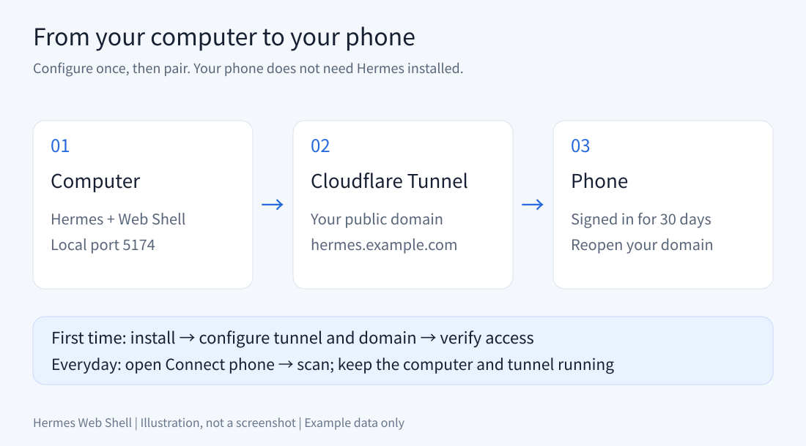
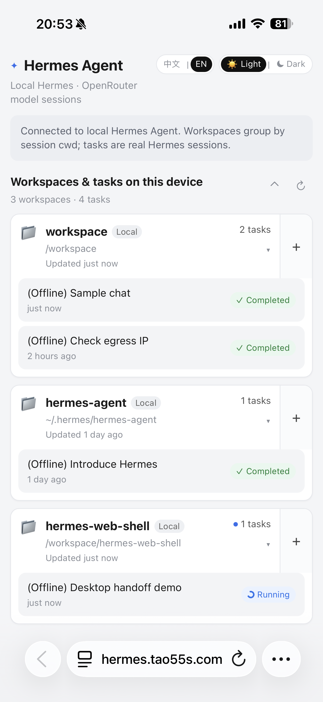
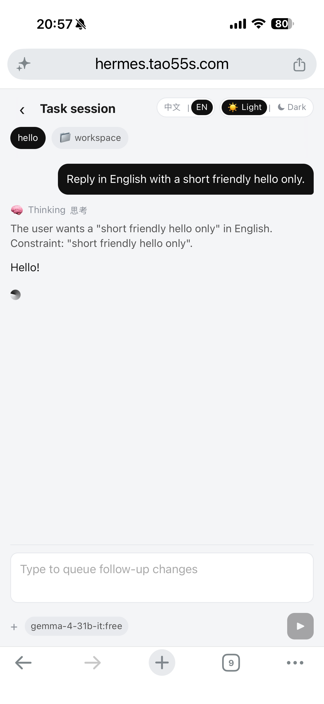

# Hermes Web Shell

**让手机连接你电脑上的 Hermes。首次配置好 Cloudflare，以后打开二维码窗口，手机扫一扫即可开始。**

这是社区维护的 Hermes 配套 Web 应用，独立运行，不是官方产品，也不是安装一个 skill 就能运行的插件。你的电脑负责运行 Hermes，手机负责查看会话、发送消息和继续任务。

## 你可以用它做什么

- 按工作区浏览本机 Hermes 会话，查看消息并继续聊天。
- 在 Windows 上直接打开二维码窗口，无需先登录电脑网页。
- 手机扫码配对后保持登录 30 天，支持取消设备连接。
- 在手机浏览器使用，提供明暗主题和中英文切换。



## 从这里开始

| 你现在的情况 | 下一步 |
| --- | --- |
| 第一次使用 | [安装与扫码连接指南](docs/getting-started.md) |
| 已经安装，想配置域名 | [手动配置 Cloudflare](docs/cloudflare.md) |
| 无法连接、扫码失败或发消息失败 | [常见问题](docs/troubleshooting.md) |
| 想修改代码或了解配置 | [开发与配置说明](docs/development.md) |

### 首次准备

需要一台已能使用 Hermes 的电脑、Git、Node.js 24，以及已接入 Cloudflare 的域名。原生二维码窗口目前仅支持 Windows；其他系统可用网页配对入口，但本项目尚未对所有平台完成验证。

```powershell
git clone https://github.com/tutao0123/hermes-web-shell.git
cd hermes-web-shell
npm ci
npm run dev
```

看到服务启动后，按[安装指南](docs/getting-started.md)配置自己的域名和隧道。**只运行上述命令还不能从手机远程访问。**

### 配置好之后

1. 在电脑上双击仓库里的 **`连接手机.vbs`**。
2. 用手机相机扫描窗口中的二维码，在浏览器中打开。
3. 开始使用 Hermes。下次手机登录仍有效时，直接打开自己的域名即可。

你也可以为 `连接手机.vbs` 自行创建桌面快捷方式。仓库不会自动在新用户桌面创建快捷方式。

二维码有效期为 5 分钟，只能兑换一次。电脑必须保持开机、联网，Hermes Web Shell 与隧道也必须运行；关闭二维码窗口不会停止后台服务。

## 当前范围

- Cloudflare 需要手动配置；还没有自动安装向导、通用安装包或开机自启。
- 当前通过 Vite 服务中的接口连接本机 Hermes；不能把构建后的静态网页单独上传就当作完整服务使用。
- 会话读取依赖本机 Hermes 数据库及 CLI。没有真实数据时，界面可能回退到演示内容。
- 手机连接的是运行本应用的电脑，不会自动迁移其他服务器上的 Hermes 会话。
- 二维码不含 Cloudflare token 或网页登录密码，但扫码者可以获得访问权限；请只向自己的设备展示。

## 界面预览

以下是历史手机版界面截图；登录及配对流程以当前版本和安装指南为准。

<p>
  
  
</p>

## English

A community companion web app for your locally installed Hermes Agent. Configure a Cloudflare Tunnel once, then open the Windows pairing window and scan its QR code with your phone. No desktop browser login is needed for the native launcher. Pairing codes are single-use and expire after five minutes; phone sessions last 30 days. Keep the host computer and tunnel running.

This is not an official Hermes plugin or skill. Start with the [setup guide (Chinese)](docs/getting-started.md). Node.js 24 is the documented runtime; Cloudflare setup is manual.

## 许可

[MIT](LICENSE) © 2026 Tao
