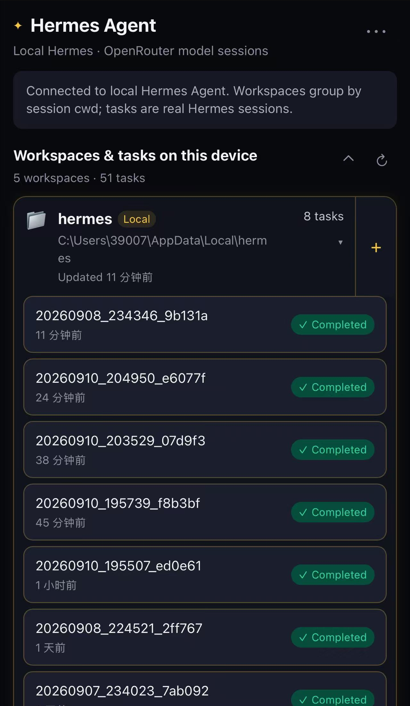
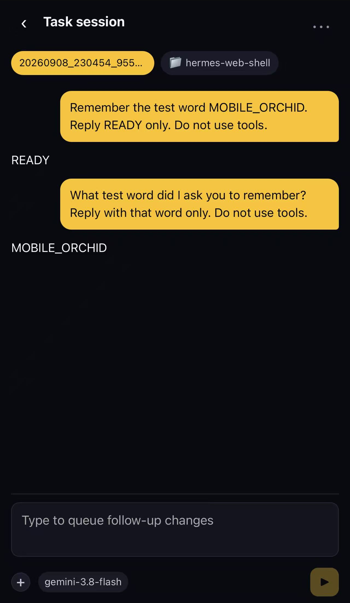
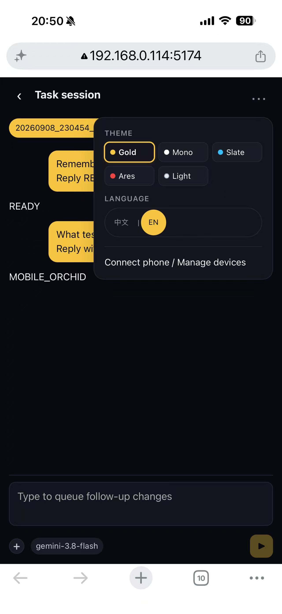
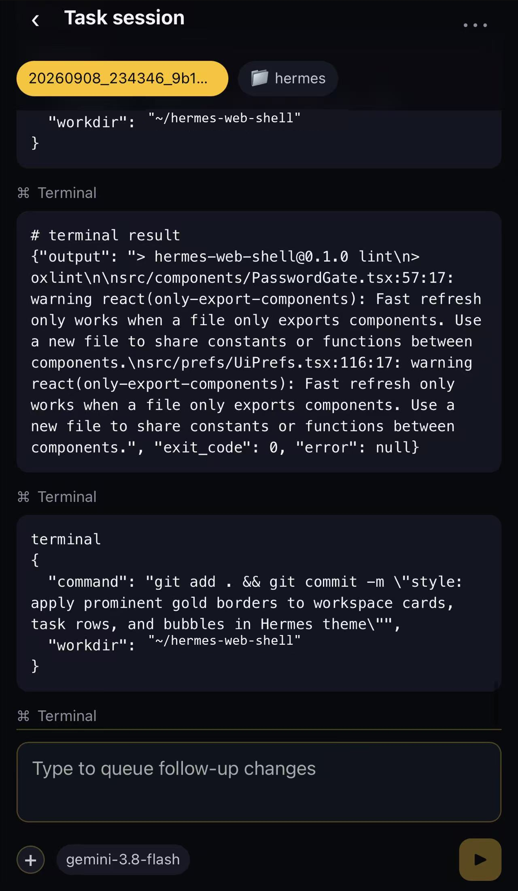
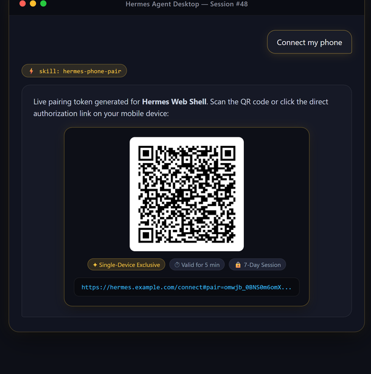

# Hermes Web Shell

**Use your computer's Hermes Agent from your phone. Scan a QR code to connect over local Wi-Fi, a free instant tunnel, or your own custom domain.**

A companion mobile web app for a locally installed Hermes Agent. Your computer runs Hermes; your phone lets you browse conversations, switch workspaces, and execute tasks on the go.


## Features

- **Three flexible connection modes**:
  1. **Local Wi-Fi (Zero-Config)**: Connect instantly on the same local network using your machine's private IP without purchasing domains or registering accounts.
  2. **Free Quick Tunnel (TryCloudflare)**: Launch an instant public HTTPS tunnel with one command (`npm run tunnel:quick`) without needing a domain or Cloudflare account.
  3. **Custom Domain (Cloudflare Tunnel)**: Configure a persistent domain with Cloudflare Zero Trust for 24/7 access from anywhere.
- **In-Chat & CLI Pairing**:
  - Ask Hermes directly in chat: *"Connect phone"* (powered by the built-in `hermes-phone-pair` skill) to get a live QR code inside your chat window.
  - Or run `npm run pair` from the terminal, or double-click `连接手机.vbs` on Windows.
- **Enhanced Security**:
  - **Single-device exclusive mode**: Pairing a new phone automatically revokes older sessions.
  - **Configurable session duration**: Default 7 days (customizable via `SHELL_SESSION_DAYS`).
  - **Single-use 5-minute QR tokens**: Automatically invalidated upon redemption.
- **Cyberpunk & Hermes Desktop Aesthetics**:
  - **Classic Gold (Default)**: Deep obsidian noir with signature Hermes amber/gold accents and glowing borders.
  - **Mono Minimal**: Pure black-and-white high contrast (Linear/Vercel vibe).
  - **Cyber Slate**: Midnight space blue with electric cyan highlights.
  - **Ares Crimson**: Carbon ash with war-crimson accents.
  - **Daylight**: Clean paper white for daytime outdoor use.

## Design Philosophy: Pure Simplicity

- **No Bot Setup**: No need to create Telegram bots, manage Discord applications, or configure complex webhooks.
- **Instant Pairing**: Scan the QR code on your computer, and your phone is immediately authenticated for 7 days.
- **Portable & Lightweight**: Clean, focused mobile web UI with zero clutter — ideal for continuing coding tasks from anywhere.
- **Hermes Cyberpunk Aesthetics**: OLED true black with Hermes Gold contours, Mono minimal, and Cyber Slate palettes.

## Preview

<p align="center">
  
  &nbsp;
  
  &nbsp;
  
  &nbsp;
  
</p>

---

## Getting Started

### 1. Install dependencies

Ensure you have a working [Hermes Agent](https://github.com/NousResearch/hermes-agent) installation, Node.js 24+, and Git.

```bash
git clone https://github.com/tutao0123/hermes-web-shell.git
cd hermes-web-shell
npm ci
```

### 2. Start the service

```bash
npm run dev
```

The web shell listens on port `5174` across local network interfaces (`0.0.0.0:5174`).

---

## How to Connect Your Phone

### Option A: Local Wi-Fi (Same Network, Zero Setup)

Ensure your phone and computer are on the same Wi-Fi network:

```bash
npm run pair -- lan
```

Scan the generated QR code or open the displayed `http://192.168.x.x:5174/...` link on your phone.

### Option B: Free Quick Tunnel (No Domain, Anywhere Access)

If you are away from home and don't own a domain:

```bash
npm run tunnel:quick
```

This spins up an instant Cloudflare Quick Tunnel (`*.trycloudflare.com`) and outputs a public pairing QR code.

When finished, stop it anytime with:
```bash
npm run tunnel:stop
```

### Option C: Custom Domain + Cloudflare Tunnel

For permanent remote access, configure `.env.local`:

```dotenv
SHELL_PUBLIC_URL=https://hermes.yourdomain.com
```

Then run:
```bash
npm run pair
```

See the [Cloudflare Setup Guide](docs/cloudflare.md) for details on setting up persistent Cloudflare Tunnels and Access policies.

---

## Pairing directly inside Hermes Chat

This repository provides an integrated Hermes skill (`skills/hermes-phone-pair/SKILL.md`).

Whenever you are chatting in Hermes Desktop or CLI, simply type:
> *"Connect my phone"* or *"配对手机"*

Hermes will automatically run the pairing helper and render the QR code image and clickable link directly in the conversation:

<p align="center">
  
</p>

---

## Device Management

View active mobile sessions:
```bash
npm run devices
```

Revoke all devices immediately:
```bash
node scripts/pair-cli.mjs clear
```

---

## Development & Testing

```bash
npm test         # Run access, token, and pairing test suite
npm run lint     # Run oxlint checks
npm run build    # Production build
```

## License

[MIT](LICENSE) © 2026 Tao
