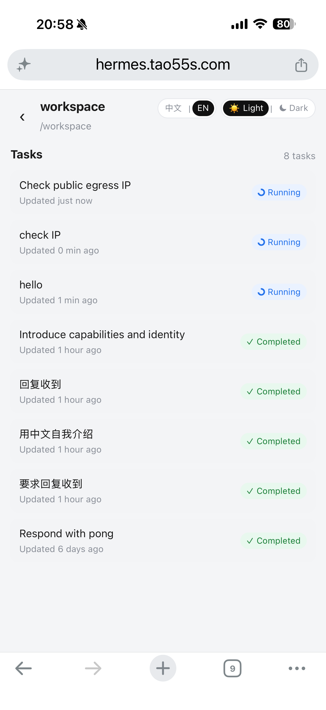

# Hermes Web Shell

移动端友好的 **本机 Hermes Agent 伴侣 Web 壳**（Vite + React + TypeScript）。

> **注意：** 本项目是社区/个人维护的 companion web UI，**不是**官方 Hermes 插件或官方产品。

通过 Vite 开发服务器中间件 `/api/hermes/*` 读取本机 `~/.hermes/state.db` 会话，并用 `hermes -z` 发送/续聊。无本机 Hermes 时自动回退到 Mock 演示数据。

---

## 功能概览

- **工作区** — 按会话工作目录（cwd）分组
- **任务** — Hermes 会话列表
- **会话** — 真实消息流 + 本机模型续聊
- **电脑交还** — DesktopOverlay（可选 `VITE_DESKTOP_URL` 指向 noVNC 等）
- **主题 / 语言** — 亮暗主题与中/英切换（工作区页可见）

## 环境要求

- 本机已安装并可运行 [Hermes Agent](https://github.com/NousResearch/hermes-agent)（可选；无则进 Mock）
- [Bun](https://bun.sh/) 或 Node.js 22.12+（推荐 Node.js 24 LTS）
- 默认读取 `~/.hermes`；可用环境变量覆盖：
  - `HERMES_HOME` — Hermes 数据目录（默认 `~/.hermes`）
  - `HERMES_BIN` — `hermes` 可执行文件路径（默认在 `PATH` 中查找 `hermes`）

## 快速开始

```bash
git clone https://github.com/tutao0123/hermes-web-shell.git
cd hermes-web-shell
bun install
bun run dev
```

Open http://127.0.0.1:5174

### 登录与手机连接

首次启动会在 `~/.hermes-web-shell/access-password.txt` 生成访问密码。网页使用服务端认证；Windows 用户配置好公网域名和隧道后，可双击 `连接手机.vbs` 直接显示二维码，无需先登录电脑浏览器。手机扫码登录保留 30 天。

### 主题与语言

工作区页右上角可切换：

- 语言：中文 / EN
- 主题：亮 / 暗

偏好保存在 `localStorage`。

## API 路由

开发服务器中间件提供：

| 方法 | 路径 | 说明 |
|------|------|------|
| `GET` | `/api/hermes/status` | Hermes / 模型状态 |
| `GET` | `/api/hermes/sessions` | 会话列表 |
| `GET` | `/api/hermes/sessions/:id` | 会话消息块 |
| `POST` | `/api/hermes/chat` | body: `{ sessionId?, message }` |

## Cloudflare Tunnel（可选）

若需从公网/手机访问本机 dev server，可用 Cloudflare Tunnel 等把流量转到 `127.0.0.1:5174`。

Vite `allowedHosts` 默认放行所有 host（适合临时隧道）。如需收紧：

```bash
# .env.local (do not commit)
VITE_ALLOWED_HOSTS=your-tunnel.example.com
# or true
VITE_ALLOWED_HOSTS=true
```

示例（请换成你自己的 hostname）：

```bash
cloudflared tunnel --url http://127.0.0.1:5174
```

**请勿**将个人 `cloudflared` 证书或凭证提交到仓库。

## 安全说明

- **不要**把模型服务凭证、Hermes 凭证等写入仓库或提交 `.env*`。
- 服务端密码登录与一次性二维码配对保护页面及 API。请妥善保管本机访问密码、本地配对凭证和隧道 token。
- 本壳可调用本机 `hermes` 并读取本机会话库，请只在可信网络使用。


## Screenshots

### Phone (live demo)




### Desktop — Chinese (ZH)


### Desktop — English (EN)


## 许可

[MIT](./LICENSE) © 2026 Tao

---

## Screenshots (EN)

Phone and desktop galleries live under [Screenshots](#screenshots): `phone-01-hello.png`, `phone-02-greetings.png`, `phone-03-workspaces.png`, plus ZH/EN desktop captures in `docs/screenshots/`.

## English (short)

**Hermes Web Shell** is a mobile-friendly companion web UI for a **locally installed** Hermes Agent. It is **not** an official Hermes plugin.

```bash
bun install && bun run dev   # http://127.0.0.1:5174
```

Demo gate password: `demo`. Theme/locale toggles on the gate and workspaces pages. Optional tunnel: point Cloudflare Tunnel (or similar) at `127.0.0.1:5174`; set `VITE_ALLOWED_HOSTS` if you need a host allowlist. Do not commit credentials or personal tunnel certs. License: MIT.

## 手机扫码连接

1. 配置 `SHELL_PUBLIC_URL=https://你的域名`，保持本机服务和 Cloudflare Tunnel 运行。
2. 在电脑浏览器打开网页，输入访问密码（默认保存在 `~/.hermes-web-shell/access-password.txt`）。
3. 点击首页「连接手机」→「生成连接二维码」，手机相机扫码即可登录。
4. 登录有效期为 30 天，服务重启后仍有效。在「连接手机」页面可取消任何设备的连接。

二维码凭证 5 分钟过期，只能兑换一次；重新生成会取消同一设备之前的二维码。凭证位于 URL fragment，兑换后立即从地址栏清除，不包含 Cloudflare token 或访问密码。二维码在本机生成，不调用第三方二维码服务。未兑换二维码在服务重启后失效。

旧的浏览器 Basic 登录已替换为网页密码登录。首次升级后需要在网页重新输入一次密码。设备会话仅以凭证摘要保存到 `~/.hermes-web-shell/sessions.json`，浏览器通过 HttpOnly cookie 保持登录。已登录设备都可管理配对与撤销。

运行认证回归检查：`node --experimental-strip-types --test scripts/test-access.mjs`。

### Windows 一键连接手机

双击仓库根目录的 `连接手机.vbs`（或本机桌面的「Hermes 连接手机」快捷方式），直接显示原生二维码窗口，无需电脑浏览器登录。窗口提供刷新二维码和管理已连接设备。服务未运行时启动本机 Vite；本机已安装 cloudflared 并保存 tunnel-token.txt 时会尝试启动隧道。关窗口不停止后台服务。

启动器通过本地文件 `~/.hermes-web-shell/local-pairing-key.txt` 获取专用于配对管理的凭证，不使用网页登录密码。服务同时验证回环地址、Host、本地凭证和无浏览器 Origin/代理标记；仅回环连接不构成授权（Cloudflare 连接器本身也使用回环）。本地配对权限不能直接读取聊天 API。其他平台仍可使用网页配对入口。

### 项目定位与首次安装

这是独立运行的 Hermes 配套应用，目前没有 Hermes 插件或 skill 安装入口。二维码窗口目前支持 Windows。首次使用仍需安装依赖、配置 Cloudflare Tunnel 和公网域名；自动打开 Cloudflare 并引导连接的安装向导尚未实现。完成首次配置后即可通过本机启动器直接扫码。
