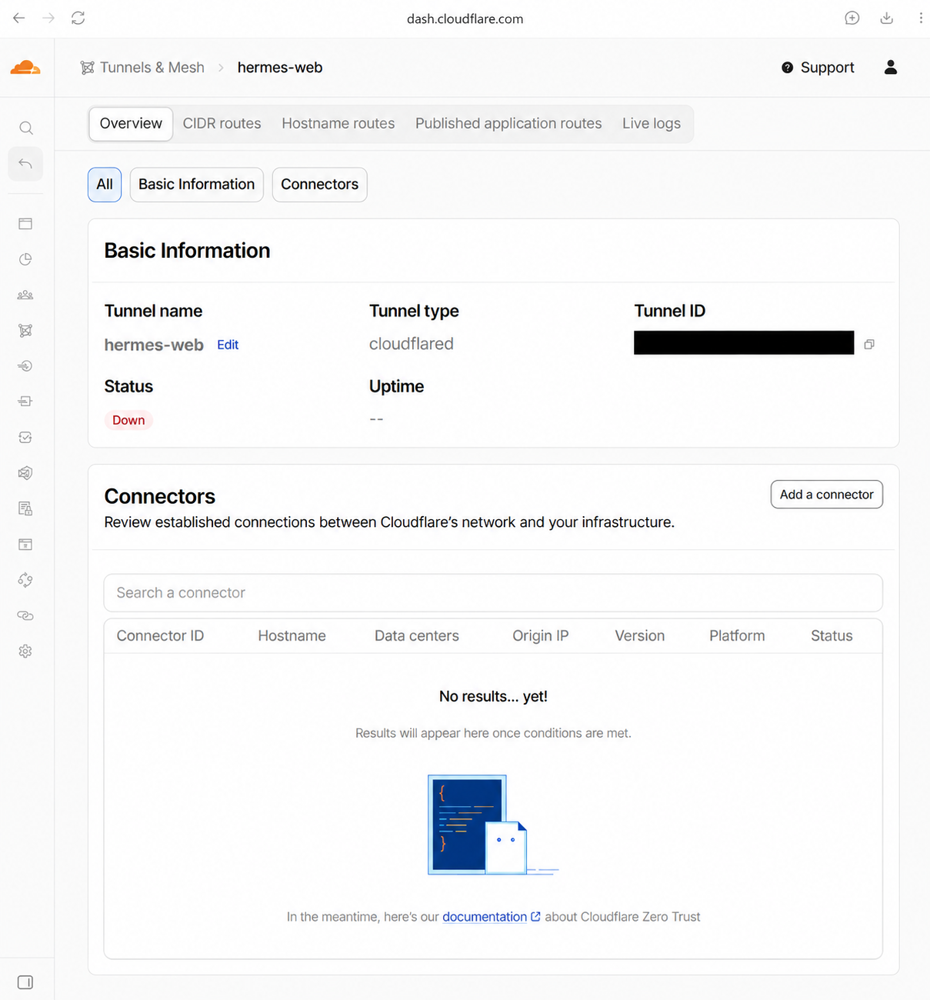
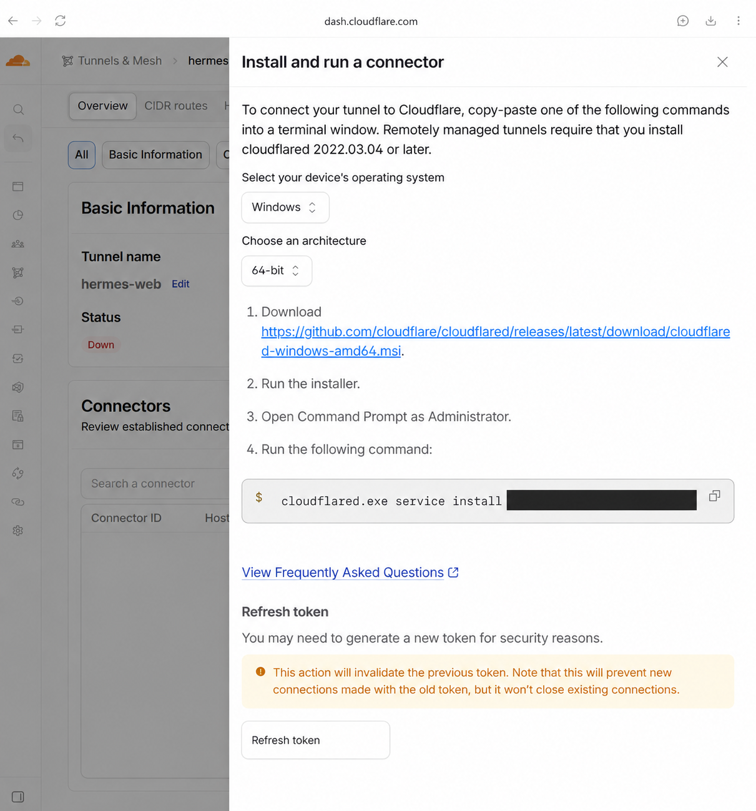
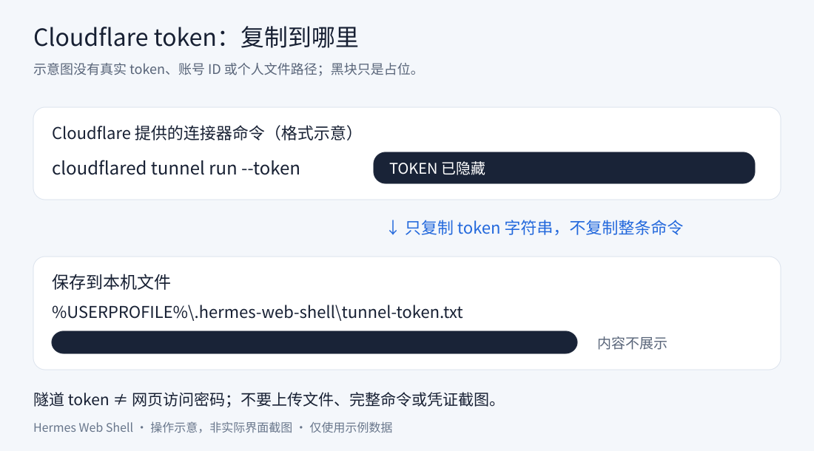
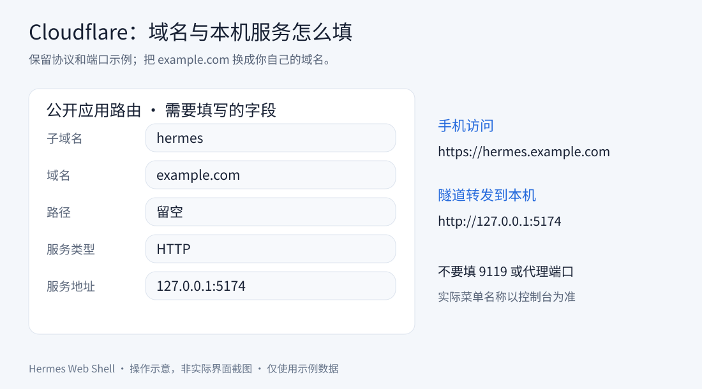

# Manual Cloudflare setup

[Installation guide](getting-started.md)

Route `https://hermes.example.com` to `http://127.0.0.1:5174` on the computer running Hermes. This guide uses a remotely managed tunnel with a fixed domain.

Dashboard labels change. Follow the [official tunnel guide](https://developers.cloudflare.com/cloudflare-one/networks/connectors/cloudflare-tunnel/get-started/create-remote-tunnel/) if the interface differs.

## 1. Create a tunnel

Sign in to the [Cloudflare dashboard](https://dash.cloudflare.com/), select your account, find Tunnels, and create a cloudflared tunnel, for example `hermes-phone`.

You can reuse a tunnel dedicated to this computer. When moving from an old server, stop its connector so requests are not distributed to the old machine. This does not migrate Hermes conversations.

### Find the connector entry point

In your tunnel's **Overview** tab, locate **Add a connector** in the **Connectors** section.



*Redacted, image-tool-edited version of a user-provided dashboard capture. This shows the pre-connection state: **Down** and an empty connector list, not a successful setup.*

## 2. Install and run the connector

Click **Add a connector** to open **Install and run a connector**. Choose **Windows** and the architecture appropriate for your computer (the example shows **64-bit**).



*Redacted, image-tool-edited dashboard capture. Copy your own command from Cloudflare, not this image. The token portion is intentionally hidden. **Refresh token** is for credential rotation and is not a required installation step.*

Follow the tunnel's Windows connector instructions on the computer running Hermes. If installed as a system service, let that service manage it instead of starting a duplicate. Wait for the connector to appear online.

To let this project's launcher start the connector, save the **tunnel run token**, not a general account API token. It is normally included in the connector command. Copy only the token string, without the command, `--token`, or quotes.

```powershell
New-Item -ItemType Directory -Force "$env:USERPROFILE\.hermes-web-shell" | Out-Null
notepad "$env:USERPROFILE\.hermes-web-shell\tunnel-token.txt"
```

Paste and save the token. Do not publish it in the repository, issues, or screenshots.

The launcher currently checks this location only:

```text
C:\Program Files (x86)\cloudflared\cloudflared.exe
```

For other installation paths, run the connector separately or adjust the script. If another cloudflared process already exists, the launcher will not start one; verify that the intended tunnel is running.

To run in a terminal, using your actual executable path:

```powershell
& 'C:\Program Files (x86)\cloudflared\cloudflared.exe' tunnel run --token-file "$env:USERPROFILE\.hermes-web-shell\tunnel-token.txt"
```

Closing that terminal stops this foreground connector. Do not duplicate a running connector. See [Tunnel tokens](https://developers.cloudflare.com/tunnel/advanced/tunnel-tokens/) for retrieval and rotation.



## 3. Add a published application route

In the tunnel's route settings, add a **Published application** route. Some dashboard versions call this Published application routes or Public Hostname.

| Field | Example |
| --- | --- |
| Subdomain | `hermes` |
| Domain | `example.com`, your domain connected to Cloudflare |
| Path | Leave empty to route the entire site |
| Service type | `HTTP` |
| Service address | `127.0.0.1:5174` |

If protocol and address share one input, use `http://127.0.0.1:5174`.

The phone uses HTTPS; the connector uses HTTP to reach the local service. Do not use HTTPS for this local origin or substitute the dashboard port `9119` or a proxy port.

If Cloudflare reports a DNS conflict, inspect existing records and old tunnel routes before changing them. Router port forwarding for 5174 is unnecessary.



> Field illustration, not a screenshot of the current Cloudflare dashboard.

## 4. Configure the QR destination

Set these entries in the project's `.env.local`:

```dotenv
SHELL_PUBLIC_URL=https://hermes.example.com
VITE_ALLOWED_HOSTS=hermes.example.com
```

Use your domain. `SHELL_PUBLIC_URL` controls the QR destination; it does not create DNS records or tunnel routes.

Restart the web service and generate a new code. Do not override the HTTP Host Header to impersonate a local address; that can break request-origin validation.

## 5. Verify

1. The local page at `http://127.0.0.1:5174` responds.
2. The connector appears online in Cloudflare.
3. Your phone can open the HTTPS domain and see the login page.
4. Open the launcher and scan its code to enter the app.

Successful QR generation does not prove that the public tunnel works. If you enabled Cloudflare Access, its separate authentication may appear first; this app does not bypass it.

Continue with [phone pairing](getting-started.md#5-scan-to-connect).
