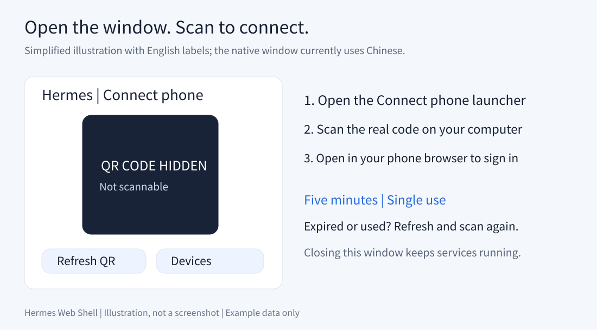

# Installation and phone pairing

[Home](../README.md) · [Cloudflare setup](cloudflare.md) · [Troubleshooting](troubleshooting.md)

After setup: **open the pairing window → scan with your phone → continue a conversation**.


## 1. Prepare your computer

This guide uses Windows PowerShell. Install [Hermes Agent](https://github.com/NousResearch/hermes-agent) and verify that chat works. Configure its model provider and network access first. Install [Node.js](https://nodejs.org/) 24 and [Git](https://git-scm.com/downloads), then open a new terminal.

You also need a Cloudflare account with a domain connected to it. Replace `hermes.example.com` throughout with your own hostname.

```powershell
node --version
npm --version
git --version
hermes --help
```

Hermes Desktop and a separate Hermes Gateway configuration are not required for pairing. This app reads local data and calls the Hermes CLI.

## 2. Install

Open PowerShell where you want to store the project:

```powershell
git clone https://github.com/tutao0123/hermes-web-shell.git
cd hermes-web-shell
npm ci
Copy-Item .env.example .env.local
notepad .env.local
```

Do not overwrite an existing `.env.local`. Keep your settings and add:

```dotenv
SHELL_PUBLIC_URL=https://hermes.example.com
VITE_ALLOWED_HOSTS=hermes.example.com
```

These are file entries, not PowerShell commands. Use your HTTPS domain without a path such as `/connect`.

## 3. Run the service once

```powershell
npm run dev
```

Keep this terminal open during initial setup. The first run initializes the credentials and directory needed by the launcher:

```text
C:\Users\YOUR_USERNAME\.hermes-web-shell\
```

Optionally visit `http://127.0.0.1:5174` on the computer. A password form confirms that the page responds. **You do not need to sign in to continue phone setup.**

## 4. Configure Cloudflare

Follow [Manual Cloudflare setup](cloudflare.md): create a tunnel, run its connector on this computer, and route your domain to `http://127.0.0.1:5174`. Save the token locally if the launcher should start the connector.

Visit your HTTPS domain on your phone. The login page confirms connectivity; you do not need to type a password.

## 5. Scan to connect

Double-click **`连接手机.vbs`** ("Connect phone"). Scan the code with your phone camera and open it in a browser.

- Codes expire after five minutes and work once. **刷新二维码** means "Refresh QR code."
- Phone sessions last 30 days. Clearing site data, changing browsers, or revocation requires pairing again.
- Bookmark your normal domain; scanning every day is unnecessary while signed in.

If double-clicking does nothing, run this from the project directory to see errors:

```powershell
powershell.exe -NoProfile -STA -File .\scripts\connect-phone.ps1
```

If script execution is restricted, follow your device or organization's rules rather than disabling protections.



> Scan the real code on your computer. Documentation images cannot connect. Illustrations use English descriptions; the native window currently uses Chinese labels.

## 6. Everyday use

After restarting the computer, double-click the launcher. It attempts to start the local service if needed, and the tunnel if cloudflared exists at its expected path, a token file exists, and no cloudflared process is running. If installed elsewhere or managed as a system service, keep the connector running separately.

Closing the window does not stop services. Sleep, shutdown, or network loss interrupts access. Automatic startup at boot is not configured.

## Manage devices

Click **已连接设备** ("Connected devices"), select a device, then **取消选中设备的连接** ("Disconnect selected device"). Its next request will be rejected until it pairs again.

Labels describe device/browser categories and may repeat; check connection times. Signed-in browser users can also pair and revoke devices. This is not a multi-user system with separate roles.

## Pair without the Windows window

Keep the service and tunnel running. Open `https://hermes.example.com/connect`, sign in with the access password, then use **连接手机** ("Connect phone") to generate a code. Password sign-in returns to the home page first.

The password is in `~/.hermes-web-shell/access-password.txt`. On Windows:

```powershell
notepad "$env:USERPROFILE\.hermes-web-shell\access-password.txt"
```

This is different from the Cloudflare token. macOS/Linux can use browser pairing, but check CLI compatibility with your actual installation.

## Update

Close the window and stop this project's web service, then run:

```powershell
git pull --ff-only
npm ci
```

Launch again. Preserve or commit local modifications if Git reports them. Domain setup usually stays unchanged. Sessions are stored outside the project and are not deliberately removed by code updates. Generate a fresh QR after restarting.
